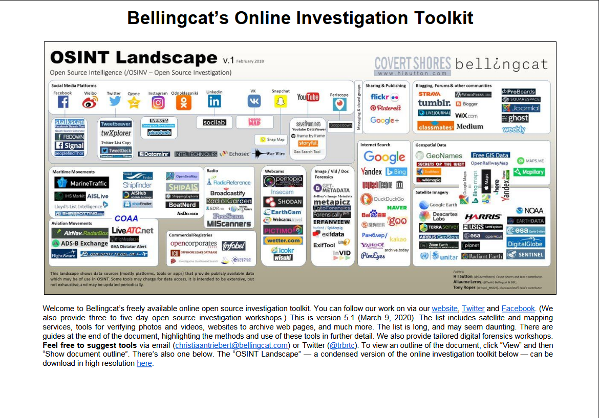
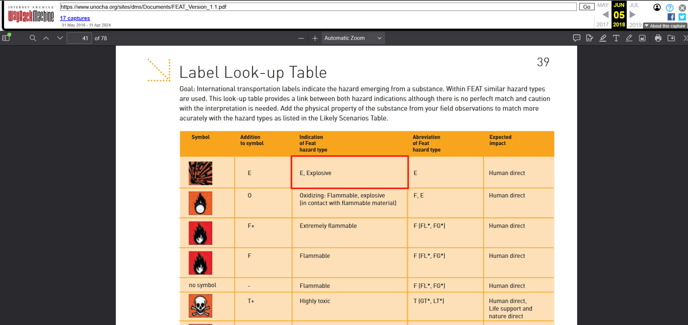

# Toolkit Tracing Challenge

Tool tips new and old.

On September 2024, Bellingcat announced the new Online Investigations Toolkit, now hosted on GitHub.
Over the years, the toolkit has taken many forms starting as a Google Doc, later a Google Sheet, and even circulated as a PDF.

In 2020, the “Guides & Handbooks” section included a link to a document that is no longer accessible, though it can still be found online.

Your task is to identify the type of hazard listed at the top of the table on page 39 within that document (answer format: Word).

## Solution

Based on the task description, I have to find the Bellingcat's Online Investigation Toolkit (PDF) document from 2020. Here is the search query that helped me find it: `bellingcat online investigations toolkit filetype:pdf before:2021`. The second entry in the search results titled "Bellingcat's Online Investigation Toolkit - AV Media Now" was created on November 11, 2020, and its link redirects to a PDF document that includes details of Bellingcat's Online Investigation Toolkit version 5.1 (March 9, 2020). The first page also includes an OSINT landscape diagram by Bellingcat that is identical to the one in the challenge, which led me to believe this is the right document.

According to the instruction, I scrolled down to the "Guides & Handbooks" section where I should find a link to a document that is no longer accessible. Of all the links listed under that section, only one seems to be a document-link (ending in `.pdf`): `https://docs.unocha.org/sites/dms/Documents/FEAT_Version_1.1.pdf`.

When I clicked on the link, as expected, it redirected me to the main page at [https://www.unocha.org/](https://www.unocha.org/), and the document was no where to be found. At this point, I decided to copy the link and search it using the [WayBack Machine archiving tool](https://web.archive.org/). In the results, however, there wasn't any snapshot of this link in 2020, so I searched the closest snapshot taken before this year, which was on June 5, 2018 at 17:16:15 UTC. This opens to a PDF document titled "The Flash Environmental Assessment Tool (FEAT)" where, at page 39, you could find a Label Look-up Table with the firt entry indicating an Explosive hazard type.

The correct answer is `Explosive`.
