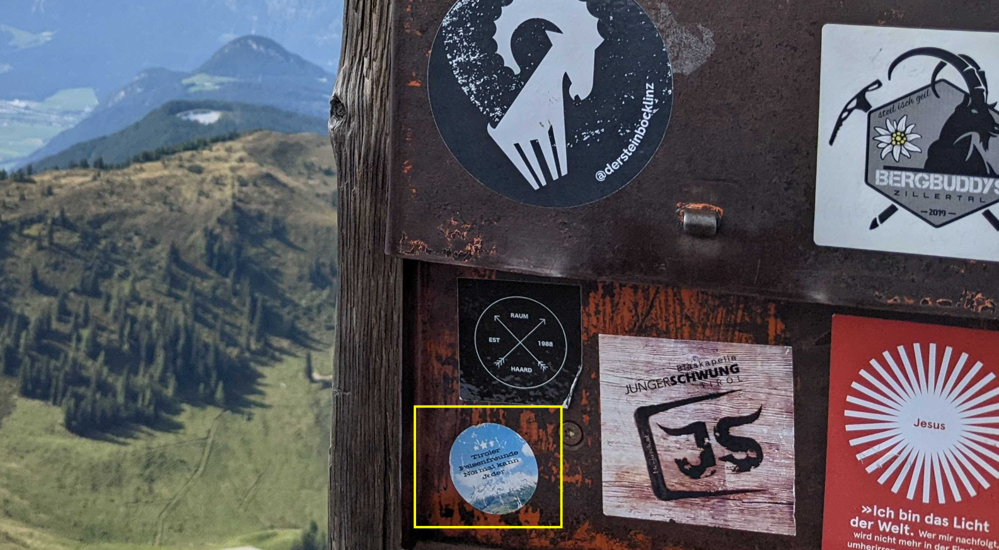
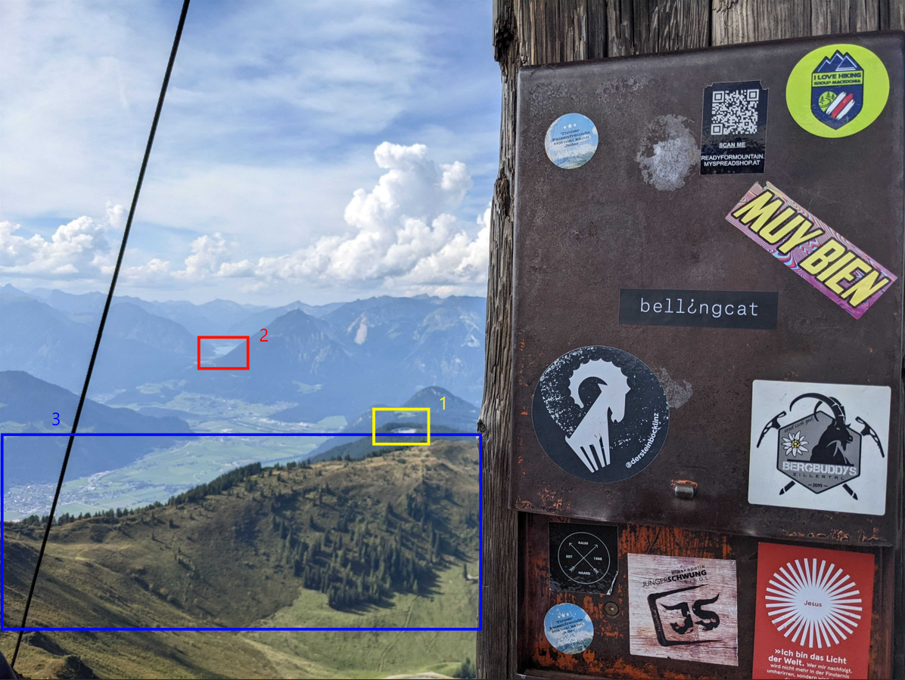
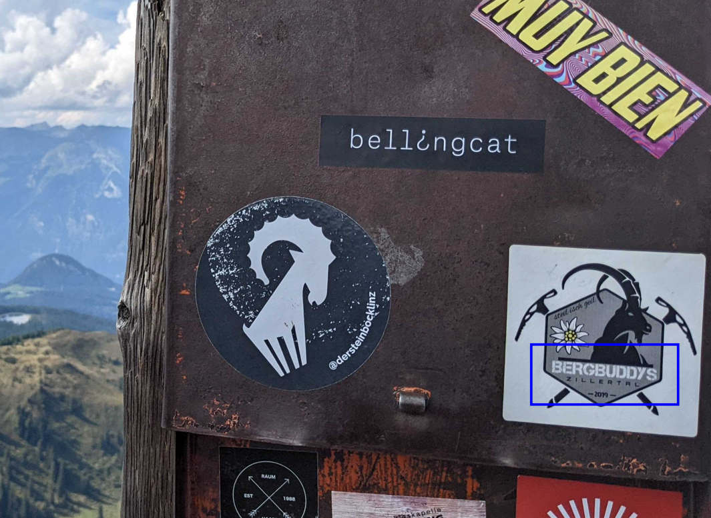
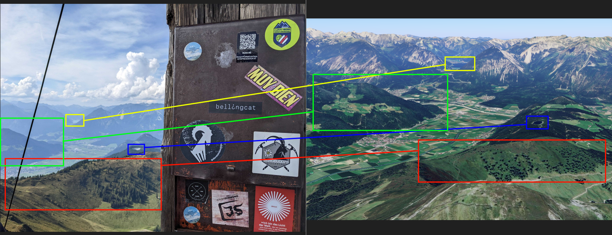
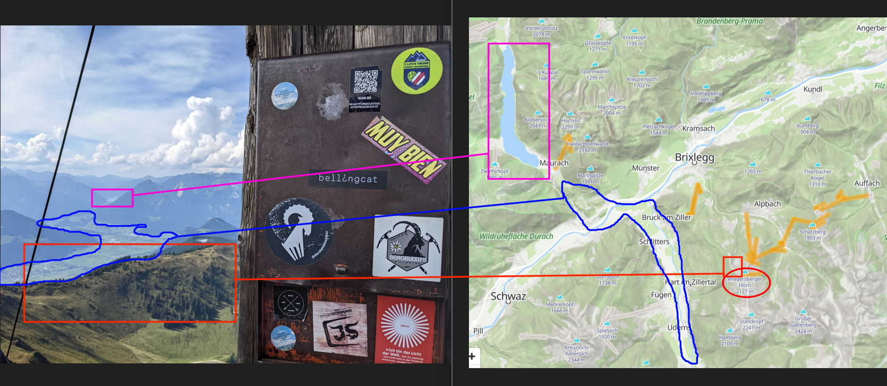

# A Sticky Situation Challenge

The mountains look great from up here!

In August of 2022, Bellingcat's Foeke Postma found himself looking over this beautiful view, complete with a Bellingcat sticker!

But where was this enviable mountaineering adventure taking place?

What is the name of the mountain on which Foeke was standing?

# Searching Proccess

The first thing I did was run the image through Google Reverse Image Search, which returned some mixed results as none of the visual matches definitively appeared to be the exact same location shown in the photograph. In one of the results, however, I did see a selfie from a Facebook post dated September 20, 2025, showing a guy standing with his back to the camera next to what appeared to be a tall flat wooden pole with a black wire hanging from the top. In the background were mountains whose shapes and features somewhat resembled those in the photograph. This made me think this could be the same spot as the photo (the pole didn't have any stickers on it, so I assumed that they were on the other side of the pole) and only later on did I realize it was a different spot than the bellingcat photo.

I then used Facebook's built in translation feature to translate the German comments to English in hopes that it might reveal where this photo has been taken. One person mentioned Austria, but that's as far as I could get with this lead. The guy seemed to be on a road trip between April and September 2025 when he took that photo but across other social medias and on Facebook there was no other information about him that could help me pinpoint the location where the photo was taken.

I went back to the Google image search results again and now started looking through the sites instead of the visual match results, where I saw the second of the top entries pointing to Tyrol, Austria. I wanted to check for any other hints in the Bellingcat photo to make sure that this was the location, so I began examining the German texts on the stickers. At the bottom left of the pole in the photo, there was this sticker with a blue sky and a snow covered mountain top in its background contained German text that translated to "Tyrolean Rock Friends Anyone can be normal."

Although the translation sounded weird (probably not translated correctly), the keyword "Tyrolean" was the confirmation I needed to believe that this place in the photo was located somewhere within the state of Tyrol (Tirol), Austria. However, at this point I made a mistake of just clicking random spots on Google Map in hopes of stumbling upon the location shown in the photo. After about half an hour of mindlessly searching to no avail, I went back and examined for any geographical clues that could make this place stand out in the map. I realized that from the mountain where the photo was taken, there was (1) a tarn on a smaller nearby mountain surrounded by trees; (2) a lake at the end of the valley in the background, which was partially obscured by other mountains; and (3) a relatively flat, lower mountain ridge neareast to the photo than the other two, and was very sparsely covered with what appeared to be larch trees as highlighted below.

The most important clue (ironically was discovered last) was a white sticker containing a drawing of a goat with texts "Bergbuddys Zillertal" printed below it. The first word pointed to a smart hotel in Oberjoch, Germany (which I ignored because it didn't seem correct), but the latter one was the name of a valley within Tyrol itself.

I looked up the valley on Google Map and very quickly noticed the linear settlement patterns of the towns and villages, which matched exactly the ones in the photo. Other inidcators that this was the correct location were tarns on the mountains to the right and a big lake behind the mountains that obscured the right end of the valley. Now that I was confident the photo was taken somewhere in this area, I switched to Google Maps’ 3D view and cross-checked it using Google Earth as well, since mountain ridges can sometimes appear flattened in Google Maps and may not accurately reflect their real-life shapes. Here is the view in Google Earth where I'm sure the photograph was taken, but this still left me needing to identify the name of the mountain.

Neither Google Maps nor Google Earth displayed the name of the mountain in question (I tried a few nearby labels that appeared, but none were correct), so I switched to [PeakVisor](https://peakvisor.com/), which provides a more comprehensive view and detailed information about mountains. After searching the Zillertal Valley again and locating the exact mountain peak, I identified it as Wiedersberger Horn, which confirmed the correct answer.

- Final Answer: `Wiedersberger Horn`
