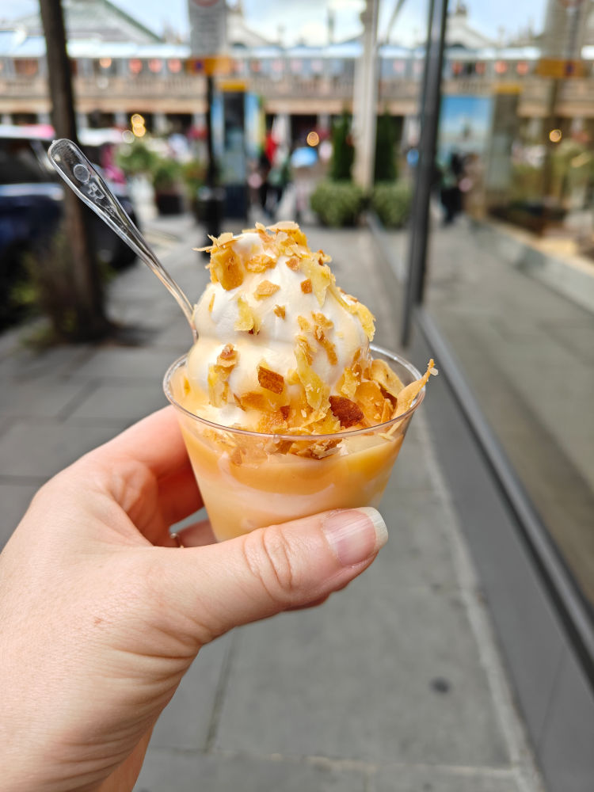
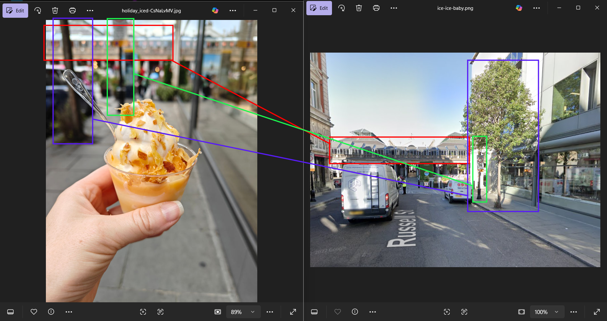
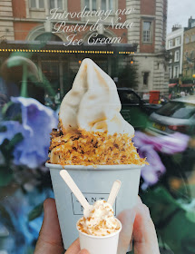
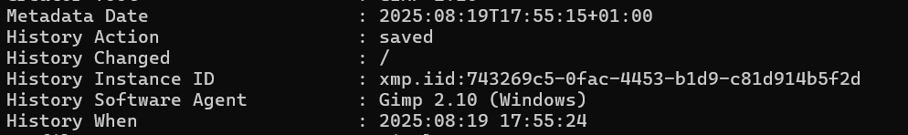

# Ice Ice Baby

In this bellingcat challenge, you're given a photo of an ice cream dessert and your task is to find the business where the ice cream is bought from:

In the background the person appears to be standing on a gray, rectangular concrete sidewalk besides a glass-fronted store or building, which is reflecting surrounding environment. The most time consuming mistake I made in this challenge is mistaking the reflection of the glass for an open area instead of a street corner. As a result, when I performed an image reverse search and most of the results are suggesting the Covent Garden in London, UK, I was confused because the although the background look very similar to it, with upper portion of the image showing a structure that looks like a balcony supported by columns and covered by a light-toned canopy roof, their ground surfaces are covered by smaller tiles with different shapes, colours and texture than the ones shown in the photo. After realizing the mistake, it did not take long to identify where this picture was taken, which appeared to be captured on Russell street, from the right-side sidewalk, looking toward the front of Convent Garden. Distinct visual markers such as the tree with some shrubs on its left side and a visually identical signpost helped confirm the location at `51.51244092174311, -0.12175260175094056`.

The next step is to identify the business from which the ice cream dessert was purchased. The seemingly untouched spoon and lack of melting of the dessert suggests that it has just been bought and have not yet been eaten before the photograph was taken, indicating that the business is located very close to the previously identified location, most likely along Russell street as well. Along the same sidewalk a bit further from the Covent Garden is a shop named `Santa Nata` which primarily sells Protuguese custard tarts. However, a quick look at their menu images on Google Map shows an image taken in May 2022 featuring their first introduction of their Pastel de Nata ice cream, which has similar white color and toppings as the dessert in the photograph, albeit served in a branded white paper cup which is different from the clear plastic cup used in the photograph, with slightly different toppings arrangement. Because of these discrepancies, I have to do extra research to verify that the dessert has really come from this store.

Since the Santa Nata's official website does not contain any images related to the dessert in question, I checked photos from their Instagram, and there was this [post](https://www.instagram.com/reel/DLrt4T2N8Um/?utm_source=ig_web_copy_link&igsh=MzRlODBiNWFlZA==) from July 4, 2025, showing a short video of the preparation of a similar ice cream dessert served in a similar fashion and inside a plastic cup that looks almost identical to the one in the photograph. This finding was further reinforced by additional information from the metadata in the original photograph (using command-line tool exiftool), which revealed that the image was last modified on August 19, 2025, very close date to the Instagram post.

From this evidence, it is apparent that during their visit to Covent Garden, London, UK in the summer of late August 2025, this individual came accross the Santa Nata store, which was at the time serving their ice cream in plastic cups and allowing customers to customize their toppings, resulting in the dessert shown in the photograph.
