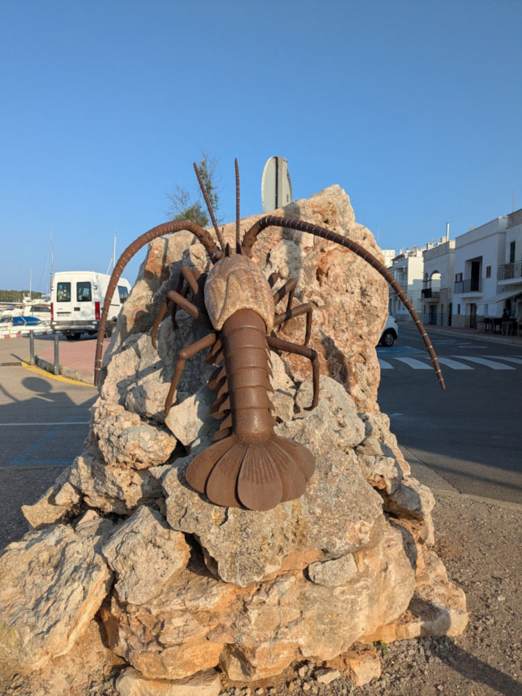
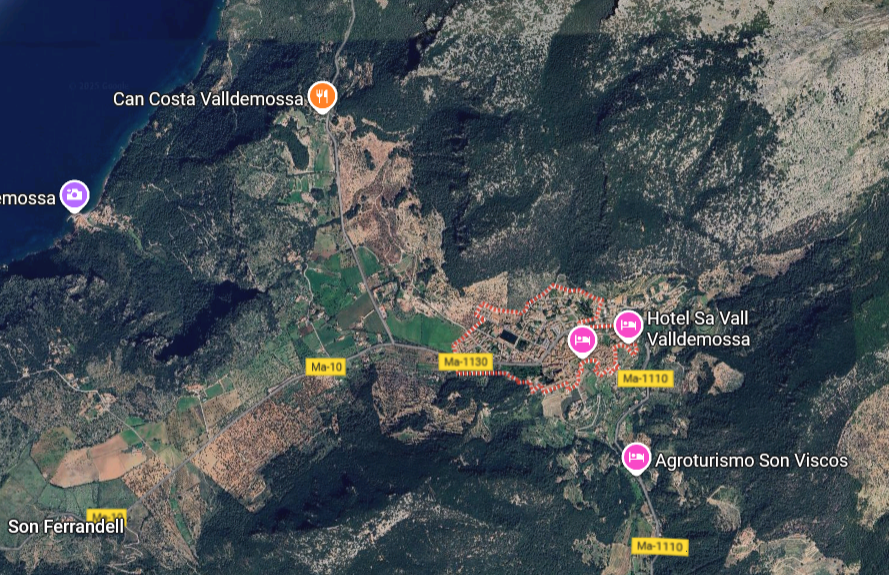
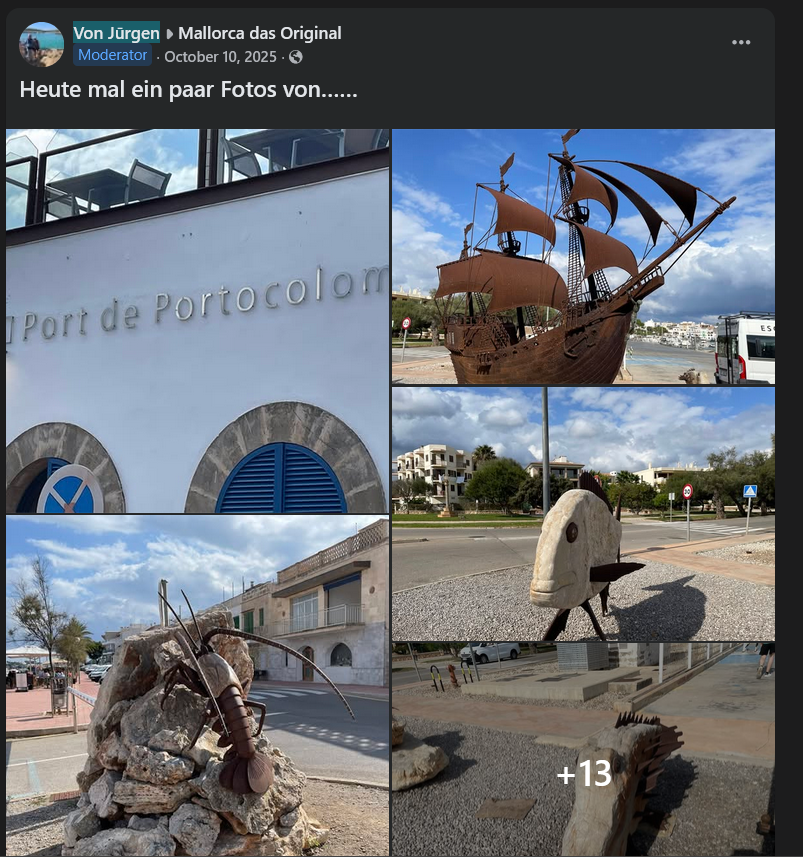
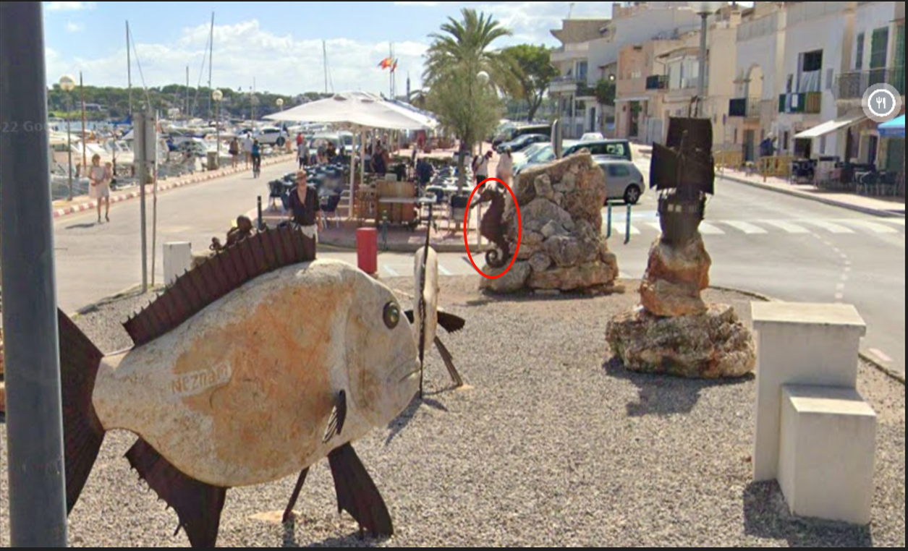
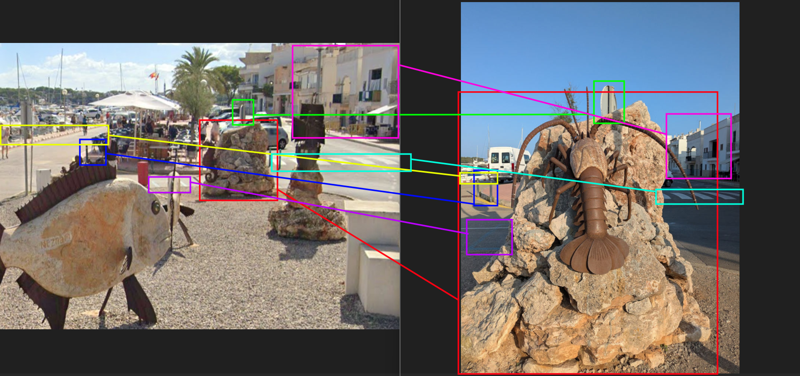

# Seem Fishy Challenge

## Description

Don't get too crabby...

Giant sea creatures appear to have taken over this picturesque town.
But this frighteningly large lobster scared another creature away.
Which animal did the lobster replace on that rock?

## Process

The first thing I did was searching the image with google lens. The results did not return anything satisfactory except for an image from facebook thats seems identical to the a lobster on a rock in the original photograph, but taken from a different angle.

Although, when I clicked on the link it opens up a facebook post of a short 2-min video capturing a person's walk through street valleys of Valdemossa, a city on the island of Mallorca in Spain. No where in the video could I find the statue shown in the original photograph. I initially assumed that statue in question must still be located within the city, so I opened google map and search for Valdemossa city. However, the city appears to locate 1.5-2 miles away from the coast of the island, whereas in the original photograph you can clearly see a marina with boats moored on the left side. This means statue could not have been in Valdemossa, but probable somewhere along the coastline of the island.

I went back to the facebook post, which belongs to a public group called "Mallorca das Original" which, as the name suggested, contain posts of visitors to different places within the island, where I assumed the image of the lobster taken from a different angle must have come from. I checked their media tab, and scrolled down to a post on October 10, 2025 by someone under username `Von Jūrgen`, which contains the image of the lobster on a rock I was looking for, along with 16 other images in the post which I assume also within the area where he had taken a photograph of the lobster. One of the other photographs shows the upper section of a white building with mounted letters on its exterior spelling **"Port de Portocolom."**

I looked up the term on google map, and it points to that same building located right next to a dock with boats and upon a closer look, the surrounding buildings have very similar architecture to the white two-story houses visible on the right side of the original photograph. I opened street view and continued tracing the path along the dock. Around 936 feet from where Port de Portocolom building was a gravel area featuring different statues on rocks, and these matched the ones shown in Von's post, except the rock where the lobster should have been was empty. The area is a tourist attraction and appeared as "sculptures de fer et de pierre" on google map, located at `P. Colom, Carrer d'En Cristòfor Colom, 64, 07670 Portocolom, Illes Balears, Spain`. This led me to think Google Map hasn't captured or updated the most recent view of the area, as upon inspecting the dates of photos taken of the same location in earlier years, I found that the most recent image was taken in July 2024, meaning the lobster must have been placed there sometime afterward. There's another photo taken of the same graveled area in September 2022, which shows a different creature on the same rock, a `seahorse`, which is the correct answer.

Below is a comparison of markers in both images to confirm the location is indeed the same from the original photograph:

