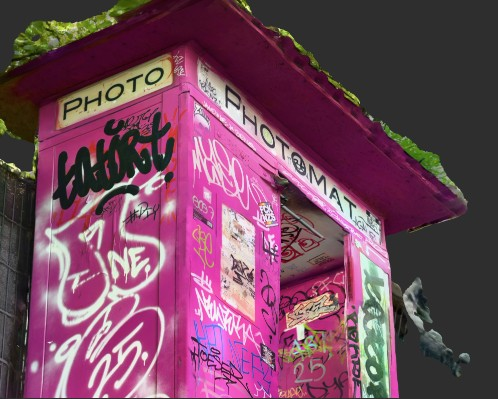
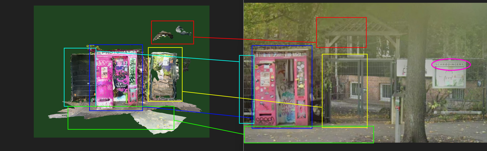

# Instant Exposure Bellingcat Challenge

## Challenge briefing

Capture the moment!

It's been a while since I last used one of those photo booths. The graffiti and stickers on this one really struck me, sadly I don't think it works any more. The place next to it was fun though!
As of October 2025, what business is accessed through the nearby gate?

Note: On this [link](https://challenge.bellingcat.com/) when you click on the Instant Exposue card under the Shifting Perspectives Challenge sets there will be more interactive option to view the rendered 3D photobooth from different angles.

## Analysis

This photobooth was quite easy to find because of how unique it looked. A quick image search with Google Lens revealed lots of results of people taking selfies inside or next to the booth. In particular, two sources I checked, an Instagram post [here](https://www.instagram.com/p/DLhXYcINbtE/?utm_source=ig_web_copy_link) and Pinterest pin [here](https://pin.it/3vi6Wrk44), both confirmed that this booth was located in Hamburg, Germany. The comment section under the Pinterest pin further revealed that this particular booth was located in Sternschanze, within Hamburg. With this information, I went to Google Map and used Street View to search through the roads inside this area and quickly found this same booth, which looked a bit different than the one shown in the challenge. The 3D version in the challenge is more recent (likely rendered and prepared in 2025, based on the briefing), whereas the Google Maps Street View imagery was captured in November 2022. Aside from these differences, the surrounding features are identical to those shown in the provided 3D view, as highlighted below.

On the right side of the gate, right next to the photobooth you can see a metal public notice board with a header panel displaying signage "SCHRØDINGERS." This appears to be an event location that allows people to rent for events like birthdays or weddings (based on information from their [website](https://schroedingers.hamburg/eventlocation/)).I assumed this was the business in question and checked the reviews tab on Google Maps, where I found that the most recent review was posted four days ago, with others dating from four to six months ago. This indicates that the business was active as of October 2025, confirming that the answer is `SCHRØDINGERS`.
